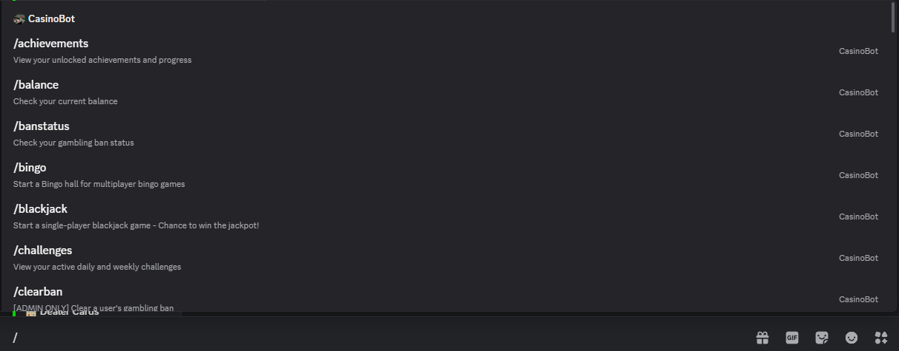
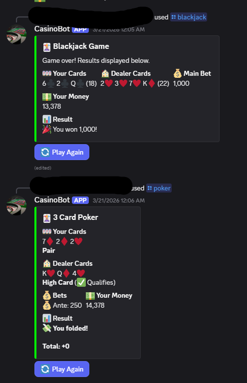
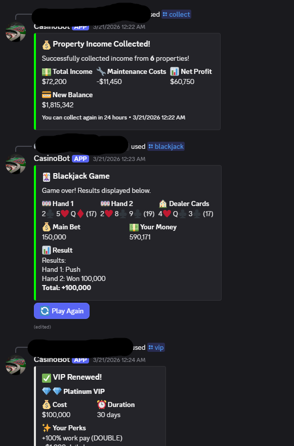
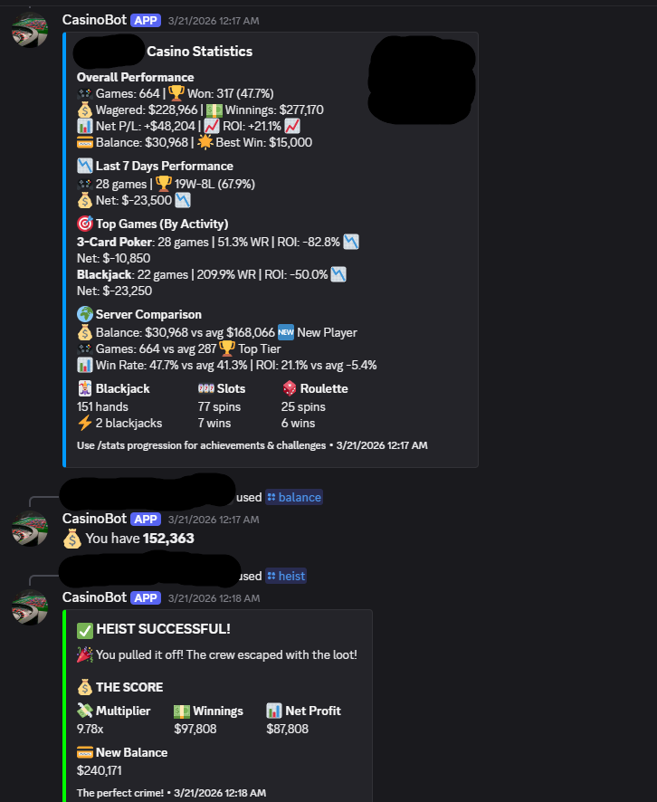
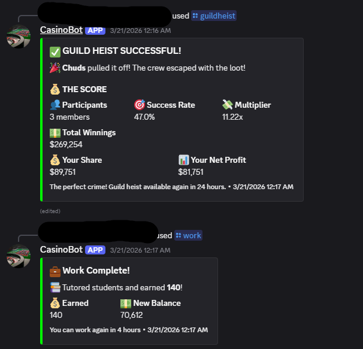

# CasinoBot

A feature-rich Discord casino bot with 16 games, guilds, achievements, and an extensive economy system. Built with Discord.js v14 and PostgreSQL.

## Screenshots

### Commands


### Games


### Economy


### Statistics


### Guild System


## Features

### Games

- **Blackjack** - Classic 21 with split, double down, and multi-table support
- **Slots** - Spin to win with various symbol payouts
- **Roulette** - Full betting interface with inside/outside bets and chip selection
- **Three Card Poker** - Ante and play poker variant
- **Craps** - Pass line, don't pass, field, and come bets
- **War** - Go to war or surrender
- **Coin Flip** - Heads or tails
- **Horse Racing** - Bet on horses and watch them race
- **Crash** - Cash out before the multiplier crashes
- **Bingo** - Multi-player bingo lobbies
- **Hi-Lo** - Guess higher or lower, build a streak
- **Poker Tournament** - Texas Hold'em tournament system
- **Plinko** - Drop a ball and watch it bounce for prizes
- **Lottery** - Buy tickets and wait for the draw
- **Mystery Box** - Open mystery boxes for random rewards
- **Money Grab** - Quick-fire money-earning minigame

### Economy

- Daily bonuses with login streaks
- Work commands with cooldowns
- Welfare system for broke players
- Loan system with credit scores and interest rates
- Gift money to other users
- Property ownership with upgrades and passive income
- VIP memberships with weekly bonuses
- Progressive server jackpot (0.5% of every bet feeds the pool)
- Transaction history tracking
- Configurable game constants (cooldowns, rates, costs)

### Progression

- **Achievements** - Unlock achievements for various milestones
- **Challenges** - Daily and weekly challenges with rewards
- **Statistics** - Track your wins, losses, and earnings
- **Leaderboards** - Compete for the top spot
- **Odds** - View win probabilities for each game

### Guild System

- Create and join guilds
- Guild treasury and donations
- Guild levels and XP progression
- Guild heists (solo and group) with ban timers on failure
- Guild challenges (weekly competitions)
- Guild seasons with leaderboards
- Guild ranks and permissions
- Guild vault with withdrawal limits
- Guild shop and contribution points
- Guild events with collaborative goals
- Guild-specific leaderboards
- Boss raids, heist festivals, and casino domination events

### Shop

- Boosts (win multipliers, XP multipliers, etc.)
- Items (lucky charms, insurance, etc.)
- Properties (passive income generators)
- VIP memberships
- Reset tokens

### Admin

- Give/take money from users
- Set jackpot amounts
- Clear gambling bans
- Clear guild heist cooldowns
- Reset users
- Ban status lookup

## Project Structure

```text
CasinoBot/
├── commands/                  # 54 slash commands
│   ├── achievements.js            # Achievement viewer
│   ├── balance.js                 # Check balance
│   ├── blackjack.js               # Blackjack game
│   ├── bingo.js                   # Bingo lobbies
│   ├── coinflip.js                # Coin flip
│   ├── craps.js                   # Craps game
│   ├── crash.js                   # Crash game
│   ├── daily.js                   # Daily bonus
│   ├── gift.js                    # Gift money
│   ├── guild.js                   # Guild management
│   ├── guild-events.js            # Guild events
│   ├── guild-leaderboard.js       # Guild leaderboards
│   ├── guild-rank.js              # Guild ranks
│   ├── guild-shop.js              # Guild shop
│   ├── guild-vault.js             # Guild vault
│   ├── heist.js / guildheist.js   # Heist system
│   ├── hilo.js                    # Hi-Lo game
│   ├── horserace.js               # Horse racing
│   ├── lottery.js                 # Lottery system
│   ├── mysterybox.js              # Mystery boxes
│   ├── plinko.js                  # Plinko game
│   ├── pokertournament.js         # Poker tournaments
│   ├── roulette.js                # Roulette game
│   ├── slots.js                   # Slot machine
│   ├── threeCardPoker.js          # Three Card Poker
│   ├── war.js                     # War game
│   ├── work.js / welfare.js       # Earning commands
│   ├── loan.js                    # Loan system
│   ├── transactions.js / history.js # Transaction tracking
│   └── ...                        # + admin, shop, stats, etc.
│
├── handlers/
│   ├── buttonHandler.js       # Main button router (147 lines)
│   ├── modalHandler.js        # Modal interaction handler
│   └── buttons/               # 16 modular button handlers (~3,120 lines)
│       ├── blackjackButtons.js
│       ├── rouletteButtons.js
│       ├── tournamentButtons.js
│       ├── bingoButtons.js
│       ├── shopButtons.js
│       ├── horseRaceButtons.js
│       ├── hiloButtons.js
│       ├── tableButtons.js
│       ├── crashButtons.js
│       ├── coinflipButtons.js
│       ├── pokerButtons.js
│       ├── warButtons.js
│       ├── crapsButtons.js
│       ├── slotsButtons.js
│       ├── challengeButtons.js
│       └── guildButtons.js
│
├── gameLogic/                 # 16 game class implementations
│   ├── blackjackGame.js
│   ├── slotsGame.js
│   ├── rouletteGame.js
│   ├── crapsGame.js
│   ├── warGame.js
│   ├── coinFlipGame.js
│   ├── crashGame.js
│   ├── hiLoGame.js
│   ├── horseRacingGame.js
│   ├── bingoGame.js
│   ├── pokerTournament.js
│   ├── threeCardPokerGame.js
│   ├── plinkoGame.js
│   ├── lotteryGame.js
│   ├── card.js
│   └── deck.js
│
├── utils/
│   ├── embeds.js              # Embed router (9 lines)
│   ├── embeds/                # Categorized embed creators (~1,860 lines)
│   │   ├── gameEmbeds.js
│   │   ├── statsEmbeds.js
│   │   └── utilityEmbeds.js
│   ├── buttons.js             # Button component builders
│   ├── achievements.js        # Achievement logic
│   ├── challenges.js          # Challenge logic
│   ├── guilds.js              # Guild utilities
│   ├── guildLevels.js         # Guild level progression
│   ├── guildXP.js             # Guild XP system
│   ├── guildRanks.js          # Guild rank management
│   ├── guildRewards.js        # Guild reward distribution
│   ├── guildEvents.js         # Guild event logic
│   ├── guildChallenges.js     # Guild challenge logic
│   ├── guildShopEffects.js    # Guild shop item effects
│   ├── cardHelpers.js         # Card game utilities
│   ├── holidayEvents.js       # Seasonal bonuses
│   ├── eventIntegration.js    # Event system integration
│   ├── bossRaid.js            # Boss raid events
│   ├── casinoDomination.js    # Casino domination events
│   ├── heistFestival.js       # Heist festival events
│   ├── heist.js               # Heist utilities
│   ├── loanSystem.js          # Loan calculations
│   ├── transactions.js        # Transaction tracking
│   ├── properties.js          # Property system
│   ├── shop.js                # Shop utilities
│   ├── vip.js                 # VIP utilities
│   ├── mysterybox.js          # Mystery box logic
│   ├── statisticsCalculator.js # Stats calculations
│   ├── errorHandler.js        # Error handling
│   ├── guardChecks.js         # Permission/validation guards
│   └── data.js                # Static data
│
├── database/
│   ├── connection.js          # PostgreSQL connection pool
│   ├── queries.js             # Query router (49 lines)
│   ├── queries/               # 10 domain-specific query modules (~4,420 lines)
│   │   ├── users.js
│   │   ├── games.js
│   │   ├── economy.js
│   │   ├── shop.js
│   │   ├── vip.js
│   │   ├── achievements.js
│   │   ├── challenges.js
│   │   ├── guilds.js
│   │   ├── heists.js
│   │   └── streaks.js
│   ├── schema.sql             # Full database schema
│   └── migrations/            # Incremental migration scripts
│
├── tests/                     # Jest test suite
│   ├── blackjackGame.test.js
│   ├── card.test.js
│   ├── challenges.test.js
│   ├── loanSystem.test.js
│   └── slotsGame.test.js
│
├── main.js                    # Bot entry point & event handlers
├── config.example.js          # Configuration template with game constants
├── .env.example               # Environment variable template
└── package.json
```

## Architecture

### Modular Design

The codebase uses a re-export router pattern. Large files were split into focused modules while maintaining backward compatibility:

- **Button Handlers**: 147-line router + 16 modules (~3,120 lines)
- **Embeds**: 9-line router + 3 modules (~1,860 lines)
- **Database Queries**: 49-line router + 10 modules (~4,420 lines)

```javascript
// database/queries.js — thin router re-exports everything
module.exports = {
    ...require('./queries/users'),
    ...require('./queries/games'),
    ...require('./queries/guilds'),
    // etc.
};

// Existing imports continue working unchanged
const { getUserMoney } = require('../database/queries');
```

### Domain-Driven Organization

Related functionality is grouped together:

- Guild system: All guild functions in `queries/guilds.js`, utilities split across `guildLevels.js`, `guildXP.js`, `guildRanks.js`, etc.
- Game buttons: Each game has its own button handler file
- Shop system: Inventory, boosts, properties in `queries/shop.js`

## Database

PostgreSQL with the following main tables:

- **users** - Core user data (money, daily/work timestamps, notifications)
- **user_games** - Game history and statistics
- **user_loans** - Active loans and credit scores
- **user_inventory** - Item ownership
- **user_boosts** - Active boost effects
- **user_properties** - Property ownership and levels
- **user_vip** - VIP membership status
- **user_achievements** - Achievement unlocks and progress
- **user_challenges** - Daily/weekly challenge tracking
- **guilds** - Guild information (name, treasury, level, XP)
- **guild_members** - Guild membership
- **guild_heists** - Heist statistics and cooldowns
- **guild_challenges** - Weekly guild challenges
- **guild_seasons** - Season history and rankings
- **guild_ranks** - Custom guild ranks and permissions
- **guild_vault** - Guild vault transactions
- **guild_shop** - Guild shop items and purchases
- **guild_events** - Active guild events and participation
- **server_jackpots** - Progressive jackpot per server
- **gambling_bans** - Temporary gambling restrictions

## Setup

### Prerequisites

- Node.js v16+
- PostgreSQL
- Discord bot token ([create one here](https://discord.com/developers/applications))

### Installation

1. Clone and install:

   ```bash
   git clone https://github.com/Matt-Wood-23/CasinoBot.git
   cd CasinoBot
   npm install
   ```

2. Configure environment variables:

   ```bash
   cp .env.example .env
   # Edit .env with your values
   ```

3. Configure the bot:

   ```bash
   cp config.example.js config.js
   # Optionally tweak game constants in config.js
   ```

4. Set up the database:

   ```bash
   # Run the schema against your PostgreSQL database
   psql -U postgres -d casinobot_db -f database/schema.sql

   # Apply migrations if upgrading
   psql -U postgres -d casinobot_db -f database/migrations/apply_all_fixes.sql
   ```

5. Start the bot:

   ```bash
   node main.js
   ```

### Environment Variables

| Variable | Required | Description |
| --- | --- | --- |
| `DISCORD_TOKEN` | Yes | Discord bot token |
| `DATABASE_URL` | Yes* | Full PostgreSQL connection string |
| `DB_HOST` | No* | PostgreSQL host (default: localhost) |
| `DB_USER` | No* | PostgreSQL username |
| `DB_PASSWORD` | No* | PostgreSQL password |
| `DB_NAME` | No* | Database name |
| `DB_PORT` | No* | PostgreSQL port (default: 5432) |
| `ALLOWED_CHANNEL_IDS` | No | Comma-separated channel IDs to restrict the bot |
| `ADMIN_USER_ID` | No | Discord user ID for admin commands |

*Either `DATABASE_URL` or the individual `DB_*` variables are required.

### Bot Permissions

Required Discord permissions:

- Send Messages
- Embed Links
- Use External Emojis
- Add Reactions
- Read Message History
- Use Slash Commands

## Testing

```bash
npm test              # Run all tests
npm run test:watch    # Watch mode
npm run test:coverage # Coverage report
```

## Development

### Adding a New Game

1. Create game logic class in `gameLogic/`
2. Create button handler in `handlers/buttons/`
3. Add game embed function to `utils/embeds/gameEmbeds.js`
4. Create slash command in `commands/`
5. Import button handler in `handlers/buttonHandler.js`

### Adding Database Queries

1. Identify the domain (users, guilds, economy, etc.)
2. Add function to appropriate file in `database/queries/`
3. Export in that file's `module.exports`
4. Function is automatically available via `require('../database/queries')`

## Tech Stack

- [Discord.js](https://discord.js.org/) v14
- [PostgreSQL](https://www.postgresql.org/) via `pg`
- [Jest](https://jestjs.io/) for testing
- [dotenv](https://github.com/motdotla/dotenv) for configuration
